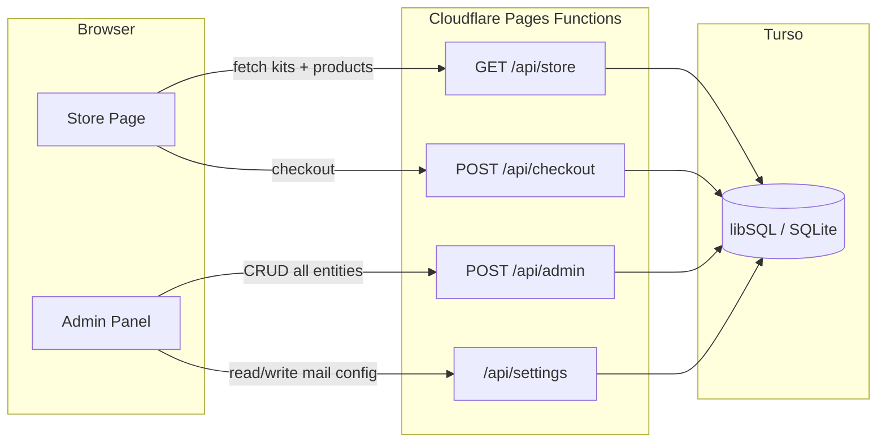

# Turso Database Backend

## Architecture




## Database Schema

Seven tables matching the current SECTIONS, plus a key-value `settings` table for mail config and future use, plus a `page_views` table for basic analytics.

```sql
-- db/migrations/001_init.sql

CREATE TABLE products (
  id         TEXT PRIMARY KEY,
  name       TEXT NOT NULL,
  flavor     TEXT DEFAULT '',
  pack_size  TEXT DEFAULT '',
  price      INTEGER NOT NULL,
  currency   TEXT NOT NULL DEFAULT 'JPY',
  comment    TEXT DEFAULT '',
  created_at TEXT DEFAULT (datetime('now')),
  updated_at TEXT DEFAULT (datetime('now'))
);

CREATE TABLE categories (
  id          TEXT PRIMARY KEY,
  name        TEXT NOT NULL,
  description TEXT DEFAULT '',
  color       TEXT DEFAULT '',
  created_at  TEXT DEFAULT (datetime('now')),
  updated_at  TEXT DEFAULT (datetime('now'))
);

CREATE TABLE kits (
  id           TEXT PRIMARY KEY,
  name         TEXT NOT NULL,
  tagline      TEXT DEFAULT '',
  bundle_price INTEGER DEFAULT 0,
  currency     TEXT NOT NULL DEFAULT 'JPY',
  color        TEXT DEFAULT '',
  created_at   TEXT DEFAULT (datetime('now')),
  updated_at   TEXT DEFAULT (datetime('now'))
);

CREATE TABLE kit_items (
  kit_id     TEXT NOT NULL REFERENCES kits(id) ON DELETE CASCADE,
  product_id TEXT NOT NULL REFERENCES products(id) ON DELETE CASCADE,
  sort_order INTEGER DEFAULT 0,
  PRIMARY KEY (kit_id, product_id)
);

CREATE TABLE subscriptions (
  id          TEXT PRIMARY KEY,
  name        TEXT NOT NULL,
  interval    TEXT DEFAULT 'monthly',
  discount    INTEGER DEFAULT 0,
  description TEXT DEFAULT '',
  created_at  TEXT DEFAULT (datetime('now')),
  updated_at  TEXT DEFAULT (datetime('now'))
);

CREATE TABLE shipping_methods (
  id             TEXT PRIMARY KEY,
  name           TEXT NOT NULL,
  carrier        TEXT DEFAULT 'none',
  regions        TEXT DEFAULT '',
  base_cost      INTEGER DEFAULT 0,
  currency       TEXT DEFAULT 'JPY',
  free_above     INTEGER DEFAULT 0,
  estimated_days TEXT DEFAULT '',
  -- Yamato-specific (stored as columns, NULL when not yamato)
  yamato_customer_code    TEXT,
  yamato_api_key          TEXT,
  yamato_environment      TEXT DEFAULT 'sandbox',
  yamato_shipper_company  TEXT,
  yamato_shipper_name     TEXT,
  yamato_shipper_name_kana TEXT,
  yamato_shipper_postal   TEXT,
  yamato_shipper_prefecture TEXT,
  yamato_shipper_city     TEXT,
  yamato_shipper_address  TEXT,
  yamato_shipper_building TEXT,
  yamato_shipper_phone    TEXT,
  yamato_product_type     TEXT,
  yamato_size_code        TEXT,
  yamato_temperature      TEXT,
  yamato_payment          TEXT,
  yamato_time_slot        TEXT,
  yamato_remarks          TEXT,
  yamato_goods_name       TEXT,
  yamato_handling_info    TEXT,
  yamato_auto_print       TEXT DEFAULT 'no',
  created_at TEXT DEFAULT (datetime('now')),
  updated_at TEXT DEFAULT (datetime('now'))
);

CREATE TABLE currencies (
  id     TEXT PRIMARY KEY,
  code   TEXT NOT NULL UNIQUE,
  symbol TEXT NOT NULL,
  name   TEXT NOT NULL
);

CREATE TABLE settings (
  key   TEXT PRIMARY KEY,
  value TEXT NOT NULL DEFAULT '{}'
);

CREATE TABLE page_views (
  id         INTEGER PRIMARY KEY AUTOINCREMENT,
  path       TEXT NOT NULL,
  referrer   TEXT DEFAULT '',
  created_at TEXT DEFAULT (datetime('now'))
);
```

A separate seed file `db/migrations/002_seed.sql` will insert the current SEED data from [src/ui/admin/pages/seed.js](src/ui/admin/pages/seed.js).

## Shared DB Helper

Create `functions/lib/db.js` — a thin wrapper that creates a Turso client from env vars and exposes query helpers. All API functions import from here.

```js
import { createClient } from '@libsql/client/web'

export function getDb(env) {
  return createClient({
    url: env.TURSO_DATABASE_URL,
    authToken: env.TURSO_AUTH_TOKEN,
  })
}
```

Using `@libsql/client/web` (the HTTP-only subpath) which works in Workers without node compat issues (~12KB).

## API Endpoints

### `functions/api/store.js` — Public store data (new)

- `GET /api/store` — Returns kits with their products (joined via `kit_items`) for the store page to render. Replaces the hardcoded `KITS` array.

### `functions/api/admin.js` — Admin CRUD (new)

- `GET /api/admin?section=products` — List all items for a section
- `POST /api/admin?section=products` — Create new item
- `PUT /api/admin?section=products&id=p1` — Update item
- `DELETE /api/admin?section=products&id=p1` — Delete item
- Validates `section` against allowed table names to prevent SQL injection.
- Each section maps to its table; columns derived from the existing `SECTIONS.fields` config.

### `functions/api/settings.js` — Settings CRUD (new)

- `GET /api/settings?key=mail` — Read a setting
- `PUT /api/settings?key=mail` — Write a setting (JSON value)

### `functions/api/checkout.js` — Updated

- Replace hardcoded `PRODUCTS` with a DB query: fetch products by ID from the `products` table.

### `functions/api/yamato.js` — Unchanged

- Already a proxy, doesn't need DB access.

## Frontend Changes

### `src/ui/admin/pages/admin.js`

- Replace the `Store` localStorage helper with `fetch()` calls to `/api/admin` and `/api/settings`.
- `renderSection()` fetches `GET /api/admin?section=X` instead of reading localStorage.
- `handleModalSubmit()` calls `POST` or `PUT /api/admin`.
- `deleteItem()` calls `DELETE /api/admin`.
- `loadMailSettings()` / `handleMailSubmit()` call `/api/settings?key=mail`.
- `seedIfEmpty()` is removed — seed data lives in the migration SQL.

### `src/ui/admin/pages/seed.js`

- Becomes unnecessary at runtime (seed data moves to SQL migration).
- Can be kept as a reference or deleted.

### `src/ui/pages/store.js`

- Replace the hardcoded `KITS` array with a `fetch('/api/store')` call on load.
- `renderKits()` becomes async, fetches data first then renders.

## Configuration

### `wrangler.toml` — Add env vars

```toml
[vars]
TURSO_DATABASE_URL = ""

# Secrets (set via `wrangler secret put`):
# TURSO_AUTH_TOKEN
# STRIPE_SECRET_KEY
```

### `.dev.vars` — Local development

```
TURSO_DATABASE_URL=file:local.db
TURSO_AUTH_TOKEN=
STRIPE_SECRET_KEY=sk_test_...
```

For local dev, `@libsql/client` can connect to a local SQLite file directly (`file:local.db`), so no Turso account is needed during development.

### `.env.example` — Updated

Add `TURSO_DATABASE_URL` and `TURSO_AUTH_TOKEN`.

### `.gitignore` — Add `*.db` for local SQLite files.

## Files Created / Modified

**New files:**

- `db/migrations/001_init.sql` — Schema
- `db/migrations/002_seed.sql` — Seed data
- `db/migrate.js` — Script to run migrations against Turso or local SQLite
- `functions/lib/db.js` — Shared DB client helper
- `functions/api/store.js` — Public store data endpoint
- `functions/api/admin.js` — Admin CRUD endpoint
- `functions/api/settings.js` — Settings endpoint

**Modified files:**

- [functions/api/checkout.js](functions/api/checkout.js) — Replace hardcoded products with DB query
- [src/ui/admin/pages/admin.js](src/ui/admin/pages/admin.js) — Replace localStorage with API calls
- [src/ui/pages/store.js](src/ui/pages/store.js) — Fetch kits from API instead of hardcoded data
- [wrangler.toml](wrangler.toml) — Add Turso env vars
- [.env.example](.env.example) — Add Turso vars
- [.gitignore](.gitignore) — Add `*.db`
- [package.json](package.json) — Add `@libsql/client`, add `db:migrate` script

**Removed at runtime (can keep as reference):**

- [src/ui/admin/pages/seed.js](src/ui/admin/pages/seed.js) — Seed data moves to SQL

